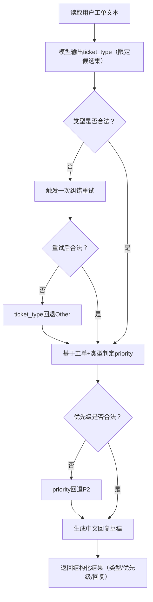

一个聚焦**真实电商售后场景**的 LLM 实战项目，核心目标是把「通用大模型 API 调用」转化为「可落地的客服动作」，帮助客服团队实现工单自动分流、优先级判定、回复草稿生成，最终达成降本增效。
 Qwen API 电商售后工单分流
[](https://www.python.org/)
[](LICENSE)

 🎯 项目解决什么问题
客服团队处理售后工单时的核心痛点：
- 工单量大，人工分流速度慢、分类标准不一致
- 紧急问题（投诉升级、品牌风险）易被淹没，响应不及时
- 客服回复质量不稳定，新人上手周期长

本项目为每一条售后工单输出**结构化、可直接落地**的三项核心结果：
1. `ticket_type`：工单类型（限定枚举：`Refund/Logistics/ProductQuality/UsageHelp/Other`）
2. `priority`：优先级（分级：`P0`（最高）/`P1`/`P2`（最低））
3. `reply`：客服回复草稿（可人工复核后直接发送）

 💰 场景的盈利价值
落地该项目可直接带来业务收益：
- **节省人力**：减少人工分单、回复初稿编写的时间成本
- **提升 SLA**：高优先级工单优先触达，缩短客户响应时长
- **降低风险**：P0 级紧急问题更快闭环，减少舆情、差评风险
- **提高一致性**：分类规则和回复风格全团队统一，提升客户体验

 📐 版本设计原则
本项目聚焦「最小可用、易学习、可落地」，核心设计原则：
- 保留主干学习路径：`密钥管理 → API 客户端封装 → 业务逻辑封装 → 批处理落地`
- 剔除分散主线的复杂功能：缓存、会话管理、效果评测、复杂 CLI 等
- 注释全中文，重点标注「代码结构 + 业务作用」，新手易理解

 📁 项目结构
```text
Qwen_Api_MiniLLM/
  .gitignore                 忽略敏感文件（如 api_key.txt）
  requirements.txt           项目依赖清单
  LICENSE                    MIT 许可证文件
  README.md                  项目说明文档
  api_key.py                 统一密钥管理模块
  api_key.example.txt        密钥文件示例（无真实密钥）
  run_chat_demo.py           基础聊天调用演示（验证客户端）
  run_classify_demo.py       单条工单分析演示（验证业务流程）
  run_batch_tickets.py       批量工单处理（最小商用闭环）
  data/                      数据目录
    tickets_sample.csv       工单示例数据（CSV）
  qwen/                      核心功能包
    __init__.py              包初始化文件
    qwen_client.py           API 客户端封装（隔离 HTTP 细节）
    mini_llm.py              售后场景业务逻辑封装
```

 📝 核心文件说明（结构 + 作用）
| 文件名                | 核心结构                                                                 | 业务作用                                                                 |
|-----------------------|--------------------------------------------------------------------------|--------------------------------------------------------------------------|
| `api_key.py`          | 环境变量读取 → 本地文件兜底 → 密钥缺失主动抛错                           | 统一密钥管理入口，避免业务层重复处理密钥逻辑                             |
| `qwen/qwen_client.py` | 1. 异常类型定义（鉴权/限流/服务端/响应异常）<br>2. `LLMClient` 类封装请求/解析<br>3. `chat_completions` 函数式兼容入口 | 隔离底层 HTTP 调用细节，让业务代码专注于提示词和场景逻辑设计             |
| `qwen/mini_llm.py`    | 1. `_normalize_label`：标签标准化<br>2. `TicketResult`：输出数据结构<br>3. `EcommerceSupportAssistant` 主类（`analyze_ticket`/`_repair_label`/`_draft_reply`） | 把通用 LLM 能力转化为售后场景专属能力（分类、优先级、回复生成）|
| `run_classify_demo.py`| 单条工单输入 → 调用业务主类 → 结构化结果打印                             | 快速验证单条工单的业务链路是否可用                                       |
| `run_batch_tickets.py`| 读取 CSV → 逐条分析工单 → 写入增强后 CSV                                 | 最小商用闭环，支持真实团队的批量工单处理流程                             |

 🚦 业务流程


 🛠️ 环境要求
 基础环境
- Python 3.10 及以上版本
- 可访问阿里云 DashScope API 的网络环境
- 有效的 `DASHSCOPE_API_KEY`（阿里云百炼平台获取）

 安装依赖
执行以下命令安装所有必需依赖：
```bash
pip install -r requirements.txt
```

 🔑 API Key 配置（二选一）
 方式 A（推荐）：环境变量（安全无泄漏）
PowerShell 中执行（替换为你的真实密钥）：
```powershell
$env:DASHSCOPE_API_KEY="你的真实DASHSCOPE API Key"
```

 方式 B：本地文件兜底（仅本地开发）
在项目根目录创建 `api_key.txt` 文件，文件内仅写一行：
```text
你的真实DASHSCOPE API Key
```
> ⚠️ 重要：`api_key.txt` 已被 `.gitignore` 忽略，**禁止提交到 GitHub**！

 🚀 运行方式
 9.1 基础聊天调用（验证底层客户端）
用于验证 API 客户端是否能正常调用 Qwen 模型：
```bash
python run_chat_demo.py
```

 9.2 单条工单分析（验证业务流程）
用于快速验证单条工单的分类、优先级、回复生成逻辑：
```bash
python run_classify_demo.py
```
 示例输出
```
Ticket Type: ProductQuality
Priority: P1
Reply Draft: 您好，非常抱歉给您带来不好的体验！关于商品质量问题，我们会立即安排售后专员为您核实，您可提供相关照片/视频，我们会尽快为您处理退款或换货。
```

 9.3 批量工单处理（最小商用闭环）
支持批量处理 CSV 格式的工单数据，输出增强后的结构化结果：
```bash
python run_batch_tickets.py --input data/tickets_sample.csv --output output/routed_tickets.csv
```

 📊 批处理 CSV 格式说明
 输入 CSV（必填字段）
| 字段名       | 说明           | 示例                                   |
|--------------|----------------|----------------------------------------|
| `ticket_text`| 工单文本内容   | "收到的商品有破损，要求退款"            |

> 可额外包含业务字段（如 `ticket_id`、`created_at`），脚本会原样保留。

 输出 CSV（新增字段）
| 字段名         | 说明           | 取值范围                                  |
|----------------|----------------|-------------------------------------------|
| `ticket_type`  | 工单类型       | Refund/Logistics/ProductQuality/UsageHelp/Other |
| `priority`     | 优先级         | P0/P1/P2                                  |
| `reply_draft`  | 回复草稿       | 中文回复文本（与业务层 `reply` 语义一致） |

 ⚠️ 异常与回退策略
项目内置完善的容错机制，保证流程不中断：
- 工单文本为空：直接输出 `Other + P2 + 您好，已收到您的反馈，我们会尽快为您处理。`
- 模型输出类型非法：触发一次纠错重试，仍失败则回退 `Other`
- 模型输出优先级非法：直接回退 `P2`（最低优先级）
- 单条工单请求报错：回复草稿写入「需人工介入」提示，不影响后续工单处理

 📚 学习路线建议
新手建议按以下步骤学习，循序渐进掌握核心能力：
1. 先阅读 `qwen/qwen_client.py`：理解 LLM API 调用链、异常分层处理逻辑
2. 再阅读 `qwen/mini_llm.py`：理解售后场景的提示词设计、标签校验与回退策略
3. 运行 `run_classify_demo.py`：观察单条工单的结构化输出，验证业务逻辑
4. 运行 `run_batch_tickets.py`：体验批量处理流程和容错机制
5. 替换数据：用你自己的售后工单数据替换 `data/tickets_sample.csv`，适配真实业务

 📄 许可证
本项目基于 MIT 许可证开源，你可自由使用、修改和分发。详见 [LICENSE](LICENSE) 文件。

---

 总结
1. 项目核心是**将通用 LLM 能力落地到电商售后场景**，输出「类型+优先级+回复草稿」三大可执行结果；
2. 设计上聚焦「最小可用」，保留核心学习路径，剔除冗余功能，新手易上手；
3. 内置完善的**异常回退策略**，保证批量处理时流程不中断，符合真实业务场景要求。
